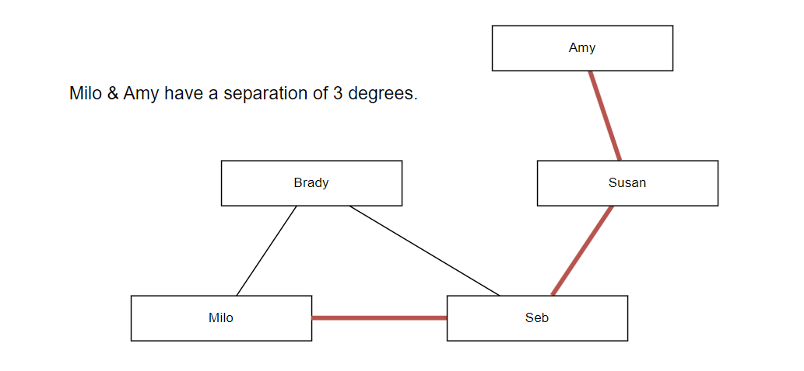

# Final Lab

- [Overview](#overview)
- [Provided Code and Files](#provided-code-and-files)
- [Working With Data](#working-with-data)
- [Processes, Commands and Output](#processes-commands-and-output)
- [Command Specifications](#command-specifications)
  - [ViewProfile](#viewprofile)
  - [ListFriends](#listfriends)
  - [ListMutuals](#listmutuals)
  - [FindSeparation](#findseparation)
  - [FriendScore](#friendscore)
  - [SuggestFriends](#suggestfriends)
  - [TotalUsers](#totalusers)
- [Error Handling](#error-handling)
- [Marking Scheme](#marking-scheme)
- [Deliverables](#deliverables)

## Overview

The objective of this final lab is to implement, exercise and assess the performance of data structures that represent a social network.

A **social network** can be considered a collection of people and the relationships between them.

In the context of this assignment, nodes will correspond to different people while arcs between the nodes represent friendships between various pairs.

Data will be supplied for the nodes and arcs representing a social network, along with with a 'command' file specifying operations to be performed on the network data.

In sections to follow, a specific output format will be defined for each command. To streamline the assessment process, your software must implement all input and output formats precisely.

You will construct software in C++ with suitable class definitions for the necessary data structures, to input the supplied data and work through the commands.

Performance is a key aspect of this lab. You will be expected not only to create a working solution, but a solution that executes quickly. The marks allocated to the software are split equally between correctness and performance.

## Provided Code and Files

Initial code has been provided and this **MUST** be used as a starting point for your implementation.

### Main.cpp

This file must **NOT** be edited. The `main.cpp` file will be replaced by a different `main.cpp` file during the marking process, along with different data files.  Therefore, any changes you make to your `main.cpp` file will be overwritten. Your software **MUST** work with the provided `main.cpp` file otherwise your code will not compile with the replacement `main.cpp` file.

### Commands.txt

The `Commands.txt` file is a file that you may edit. This is a list of commands that your program is to execute.

### Solution class

The provided Solution class must **NOT** be renamed otherwise the replaced `main.cpp` file will not be able to find it.  You may, however, change the way the method parameters are passed (to satisfy Parasoft rules) but you must not change the type (i.e. string) - to reiterate **DO NOT** change any code inside of main.cpp.  Do **NOT** output to the 'cout' apart from at the end of your code.

The `BuildNetwork(...)` method will be used to:

1. Read in the network definition data (from `Users.csv` and `Friendships.csv`)
2. Construct your internal data structure(s). This method **MUST** return `true` if the build is successful (e.g. files have been correctly read) or `false` if the build is unsuccessful.  You **MUST** not change either the name or the parameters of this method.

The `ProcessCommand(...)` method is used to process each command in turn. This method **MUST** return `true` if it processes the command successfully or `false` if it does not process the command successfully. You **MUST** not change either the name or the parameters of this method.

The output file stream `_outFile` has already been created for you.  You **MUST** use this to output your results.  **DO NOT** change the output filename.

## Working With Data

Data is supplied in `csv` format (comma-separated variables) in two files: namely `Users.csv` and `Friendships.csv`.

### Users.csv

For the network Nodes (Users) file, each line of text represents a person and comprises their:

- Unique Identifier - an 8-character hexadecimal string
- Full Name - a text string of at most 128 characters (including spaces)
- Age - an integer in the range 18 to 80.
- Country - a 3-letter country code from the ISO 3166 standard.
- Rate of Activity - a real number between 0 and 1 representing how active the user is on the platform.

Examples are shown below:

```text
1AAD93E2,John Smith,23,GBR,0.82
3E383F72,Alex Tiller,34,DEU,0.20
```

#### Featured Countries

For this task, only 8 different countries will be present in any data your program is tested on. These countries and their corresponding codes are shown in the table below.

| Country Code | Country Name |
| ----- | ----- |
| DEU | Germany |
| DNK | Denmark |
| FIN | Finland |
| FRA | France |
| GBR | United Kingdom |
| NLD | Netherlands |
| NOR | Norway |
| SWE | Sweden |

### Friendships.csv

Data for each Arc (Friendship) will comprise reference numbers for two people that are friends within the network. Friendships are bi-directional.

Example arc data is shown below:

```text
1AAD93E2,3E383F72
467AAE17,1AAD93E2
```

### Restrictions & Constraints

You are safe to assume that the individual lines of the data files provided will be correctly formatted and represent valid entities.

A user may have any number of friends, including zero. Therefore, it is possible for a user(s) to be entirely isolated from the rest of the network.
Your implementation should account for these circumstances, see the section on 'Error Handling'.

### Data Structures

You must define suitable C++ classes to hold the social network data, preferably using dynamic data structure techniques to build a single structure which will allow processes to follow connections (friendships) in sequence from a given user to reach nodes representing other users (see example diagram in fig 1).

The data representing users may be held in a linked list or an array of node objects, with a suitable access mechanism so that nodes can be accessed according to their unique identifier.

Nodes should also store the additional profile information about the user they represent.


**Fig 1. Example of a suitable dynamic network data structure**

Data about friendships between users should be stored in a manner which allows for all friends of a given user to be accessed from the specific user's node. This will allow for traversal of the network - required for calculating the degrees of separation between users.

Note that the input data will show each friendship between users only once, while friendships themselves are bi-directional (two-way).

The diagram in fig 1 shows how nodes representing users might be connected if the users are friends. The structure depicted is a suggestion only, you are not required to create the same structure or abstractions in your own software.

## Processes, Commands and Output

The provided `BuildNetwork(...)` method will:

1. Read in the network definition data from ```Users.csv``` & ```Friendships.csv```.
2. Construct the internal data structure(s).
3. This method **MUST** return `true` if the network build is successful or `false` if the network build is unsuccessful.

### Processing Commands

Each Command will be passed by the main method directly for processing using the provided `ProcessCommand(...)` method.
This method will:

1. Invoke appropriate process code.
2. Produce the required output as defined in sections to follow.
3. This method **MUST** return `true` if it processes the command successfully or `false` if it does not process the command successfully.

The Commands will contain certain formats (notice white spaces rather than commas).
A list of Commands with example data can be found below.
For testing purposes, you should write your own example data.

Each Command should result in an output comprising:

1. The text of the original command on one line.
2. Required output on subsequent line(s).
3. Followed by a single blank line.

## Command Specifications

### ViewProfile

Command **ViewProfile** will list details about the specified user, if found.

'Activity Rate' is given as a percentage (rounded to the nearest whole number).

Note also that the full country name is displayed.

#### Example Command

```text
ViewProfile C40AE8BB
```

#### Example Output

```text
ViewProfile C40AE8BB
Name: Regina Wright
Age: 18
Country: France
Activity Rate: 68%
Friends: 59

```

----

### ListFriends

Command **ListFriends** will present the full list of friends for a specified user.

Note that a count precedes the list of users. No ordering of the users listed is necessary.

#### Example Command

```text
ListFriends C40AE8BB
```

#### Example Output

```text
ListFriends C40AE8BB
4 friend(s) found.
Casey Scott [ID:FF21C4F2]
Angela Cox [ID:A575247E]
Barbara Green [ID:DB5C8C60]
Cameron Lee [ID:58043C57]

```

----

### ListMutuals

Command **ListMutuals** will present the full list of mutual friends between two specified users.
Note that a count precedes the list of users. No ordering of the users listed is necessary.

#### Example Command

```text
ListMutuals 714CD374 ECDD6D18
```

#### Example Output

```text
ListMutuals 714CD374 ECDD6D18
5 mutual friend(s) found.
Barbara Green [ID:DB5C8C60]
Frank Bailey [ID:3A4508B3]
Freya Williams [ID:1C65FFE1]
Ana Green [ID:FCEB8817]
Sebastian Howard [ID:52446C6B]

```

----

### FindSeparation

Command **FindSeparation** will calculate the degree to which two specified users are separated.
This value represents the number of 'degrees of separation' between the two users.

This value is found as the length of the shortest sequence of connections (friendships) between two users. An example is shown below.



For this exercise, if a sequence of friendships between two users cannot be found or has a length greater than 6, consider this a separation of 6 degrees.

#### Example Command

```text
FindSeparation C40AE8BB 714CD374
```

#### Example Output

```text
FindSeparation C40AE8BB 714CD374
2 degree(s)

```

----

### FriendScore

Command **FriendScore** will find the 'Friend Score' between two specified users, according to the formula featured below.

We say that between users who are already friends, the Friend Score is 0. As such, a Friend Score always exists between distinct users.


#### Example Command

```text
FriendScore C40AE8BB 714CD374
```

#### Example Output

```text
FriendScore C40AE8BB 714CD374
361.16

```

----

### SuggestFriends

For a given user, the command **SuggestFriends** will find the five other users with the highest 'Friend Score' values among all users eligible to become friends with the specified user.

The five best suggestions found are listed in **descending order** by Friend Score, and the number of mutual friends between the suggested user and the subject are also included as shown below.

For this exercise, you are safe to assume that there will be at least 5 other users eligible to become friends of any given user in the dataset.

#### Example Command

```text
SuggestFriends 714CD374
```

#### Example Output

```text
SuggestFriends 714CD374
Jake Gonzalez [ID:ECDD6D18] - 5 mutual friend(s)
Max Barnes [ID:3BE36661] - 6 mutual friend(s)
Hugo Adams [ID:EEA331CA] - 4 mutual friend(s)
Iris Wilson [ID:2DAAF342] - 4 mutual friend(s)
Travis Perry [ID:D439A72F] - 4 mutual friend(s)

```

----

### TotalUsers

Command **TotalUsers** presents the total number of users stored in the network.

This command also supports listing country codes in order to restrict the statistic to consider only users in those regions.

#### Example Command A

```text
TotalUsers
```

#### Example Output A

```text
TotalUsers
5000

```

#### Example Command B

```text
TotalUsers GBR FRA
```

#### Example Output B

```text
TotalUsers GBR FRA
315

```

## Error Handling

Should an operation be invalid or illogical (such as querying a non-existent user etc.) output 'Error', followed by a blank line.

For your own purposes, you can choose to include further explanation on the same line as the 'Error' prefix. Examples of this can be seen below.

#### Example Command A

```text
ViewProfile 0A0A0A0A
```

#### Example Output A

```text
ViewProfile 0A0A0A0A
Error: User not found.

```

#### Example Command B

```text
OrderPizza
```

#### Example Output B

```text
OrderPizza
Error: Unrecognised command.

```

> Note: in both of these cases, outputting plainly 'Error' would also be considered correct.

## Marking Scheme

A detailed marking scheme has been published.
This marking scheme will contain a breakdown of all of the marks and will give you the ability to mark yourself as you develop your software and write your lab book.

## Deliverables

### Code submission

You are to submit all of your code to GitHub Classrooms.

Please ensure the following requirements are met when submitting your source code.

- only submit source code that is used in this application
- clean the solution prior to submission
- ensure that the solution builds
- ensure that Parasoft C++ Static Test runs on the solution

The code can ONLY be submitted via the provided GitHub Classroom repository (ie Lab I (the final lab), a link to which is provided on Canvas)

It is your responsibility to make very sure that all the source code files required to make your application are committed to the GitHub Classroom repository. It is easy to forget to add or push some while you are developing. A good way to check this is to check out your project to a different folder and see if you can build it as follows:

1. Clone your repository in to an empty folder.
2. Open the solution in Visual Studio
3. Run your project(s). Remember that to achieve full marks your submitted code must compile and run.
4. If any of those previous steps doesn't work you probably forgot to add/commit/push one or more of your files. GOTO step 1.

Do not leave it until the last minute to commit and push your work. Committing your repository all in one go may take upwards of an hour to complete. When you do commit your work it is recommended that you include the phrase "ACW FINAL" in the commit log. This indicates that you have made a submission. You can do this multiple times before the deadline if you need to. Submissions made after the deadline will be subject to the usual penalties.

### Parasoft Results

Parasoft C++ Static Test results for your source code (in the form of an auto-generated HTML report)

### Lab Book

Create a new chapter (Lab I) in your lab book (maximum 2000 words), which contains:

- Design: Describe (with relevant diagrams) your data structures, and associated algorithms.
- Results: Provide timing results for the `BuildNetwork(...)` method and each Command as a row in a table.  Explain how these results were captured.

    | Command                  | Average Timing (ms) |
    | ------------------------ |---------------------|
    | BuildNetwork             | 2587                |
    | ViewProfile              | 56                  |
    | ListFriends              | 956                 |
    | ...                      | ...                 |

- Performance critique:  Explain the process you followed to improve performance.  Was it effective? Describe any changes you made to the data structure design or algorithms that improved performance.  What did you learn about C++ optimization.
